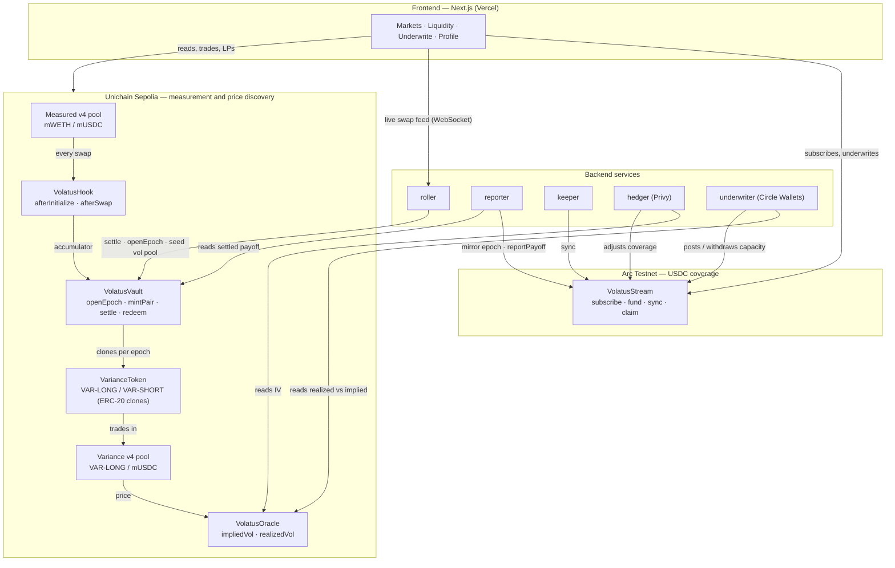
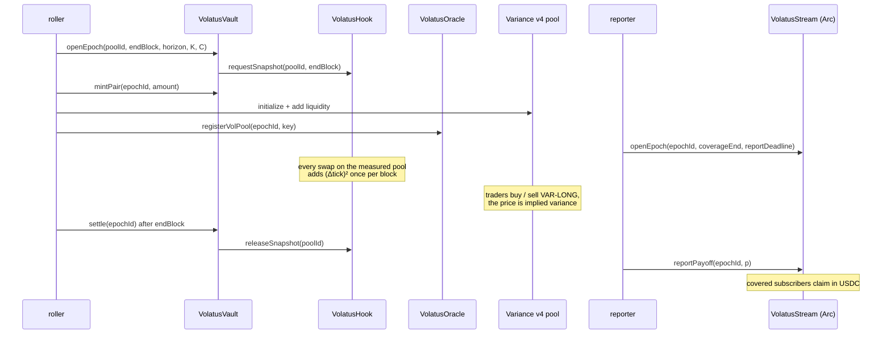
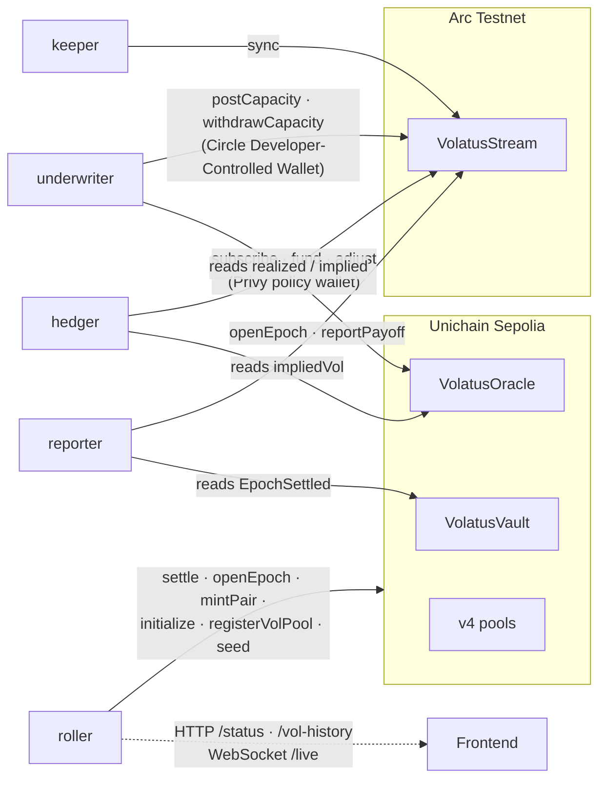
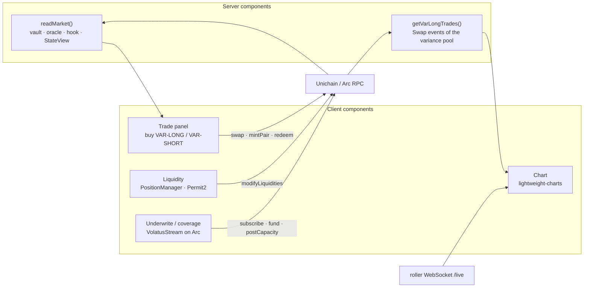

# Volatus

**An on-chain market for volatility, measured by a Uniswap v4 hook and settled in USDC.**

Volatus measures how much a Uniswap v4 pool actually moves, directly from its own swaps, and lets
anyone trade that measurement. The price of the resulting token is the market's implied
volatility for that pool — a number other protocols can read in a single view call. Coverage
against that volatility can be bought per second, in USDC, on Arc.

| | |
|---|---|
| **Live application** | [volatus-theta.vercel.app](https://volatus-theta.vercel.app/) |
| **Documentation** | [volatus-theta.vercel.app/docs](https://volatus-theta.vercel.app/docs) |
| **Networks** | Unichain Sepolia (1301) · Arc Testnet (5042002) |
| **Hackathon tracks** | Uniswap Foundation — v4 Hooks · Circle — Arc & USDC |
| **Developer feedback** | [`FEEDBACK.md`](https://github.com/VolatusHQ/contracts/blob/main/FEEDBACK.md) |

### Repositories

The project is split across three repositories. This README is identical in all of them.

| Repository | Contents | Stack |
|---|---|---|
| [VolatusHQ/contracts](https://github.com/VolatusHQ/contracts) | Hook, vault, oracle, variance tokens, Arc stream | Solidity 0.8.26, Foundry, OpenZeppelin `uniswap-hooks` |
| [VolatusHQ/backend](https://github.com/VolatusHQ/backend) | Five services that operate the protocol across both chains | TypeScript, Node 20, viem, pnpm workspaces |
| [VolatusHQ/frontend](https://github.com/VolatusHQ/frontend) | Trading, liquidity and underwriting application | Next.js 16, React 19, wagmi, viem |

---

## Contents

1. [Problem](#problem)
2. [How it works](#how-it-works)
3. [Architecture](#architecture)
4. [Sponsor integrations — where to verify](#sponsor-integrations--where-to-verify)
5. [Deployments](#deployments)
6. [Design properties](#design-properties)
7. [Testing](#testing)
8. [Running locally](#running-locally)
9. [Scope and limitations](#scope-and-limitations)

---

## Problem

Liquidity providers on volatile pairs are short volatility: they earn fees and lose when price
moves in either direction. Protocols compensate them through token emissions, which is a
volatility premium paid in dilution, sized without a price.

That price does not exist on-chain. Implied volatility is quoted for a handful of large assets on
off-chain venues; for the long tail of tokens that trade on Uniswap, there is no market-derived
volatility figure at all. Dynamic-fee hooks, lending markets and risk systems estimate it from
trailing windows because nothing forward-looking is available to read.

Volatus provides that price, derived from and traded on Uniswap itself.

## How it works

The system has three layers. Measurement and price discovery run on Unichain; coverage
subscriptions run on Arc.

### 1. Measurement — a v4 hook

`VolatusHook` observes the measured pool in `afterSwap` and accumulates realized variance from
the pool's own price path. Because a Uniswap tick is a logarithmic price
(`tick = log₁.₀₀₀₁(price)`), the log return between two observations is `Δtick · ln(1.0001)`,
so realized variance is a sum of squared tick deltas — no external oracle and no floating point:

```
realizedVariance = Σ (Δtickᵢ)² · (ln 1.0001)²
```

At most one observation is recorded per block, and each tick delta is clamped to ±1,000.

### 2. Price discovery — variance tokens in a second v4 pool

Each epoch, `VolatusVault` issues a pair of ERC-20 variance tokens against USDC collateral:

| Token | Settles for |
|---|---|
| `VAR-LONG` | `p` USDC — rises with realized variance, capped |
| `VAR-SHORT` | `1 − p` USDC — the complement |

One unit of collateral mints one of each, and a pair always redeems for at most one unit, so the
vault is fully collateralized by construction. At settlement, with strike `K` and cap `C`:

```
p = clamp(V − K, 0, C − K) / (C − K)
```

`VAR-LONG` trades against USDC in its own Uniswap v4 pool. Its price, in `(0, 1)`, is the market's
expectation of normalized variance. `VolatusOracle` converts that price into annualized implied
volatility and exposes it through `impliedVol(poolId)`.

### 3. Coverage — per-second subscriptions on Arc

`VolatusStream`, deployed on Arc, sells variance coverage as a subscription priced per second in
USDC. Subscribers fund a balance; coverage accrues second by second while the balance lasts and
stops when it runs out. Underwriters post USDC capacity and receive the premium. When an epoch
settles on Unichain, its payoff is reported to Arc and covered subscribers claim in USDC.

---

## Architecture

### System overview



### Epoch lifecycle



### Smart contracts

| Contract | Chain | Responsibility |
|---|---|---|
| [`VolatusHook`](https://github.com/VolatusHQ/contracts/blob/18411d6fb3a2cc267be2a3c2c6ff4f123d83c1b2/src/VolatusHook.sol#L65) | Unichain | v4 hook. Accumulates squared tick deltas per pool; snapshots the accumulator at an epoch boundary. |
| [`VolatusVault`](https://github.com/VolatusHQ/contracts/blob/18411d6fb3a2cc267be2a3c2c6ff4f123d83c1b2/src/VolatusVault.sol#L45) | Unichain | Opens epochs, holds collateral, mints and burns pairs, settles from the accumulator, redeems. |
| [`VarianceToken`](https://github.com/VolatusHQ/contracts/blob/18411d6fb3a2cc267be2a3c2c6ff4f123d83c1b2/src/VarianceToken.sol#L22) | Unichain | ERC-20 leg, deployed as an EIP-1167 clone per leg per epoch; vault-only mint and burn. |
| [`VolatusOracle`](https://github.com/VolatusHQ/contracts/blob/18411d6fb3a2cc267be2a3c2c6ff4f123d83c1b2/src/VolatusOracle.sol#L35) | Unichain | Reads the variance pool's price and returns implied and realized volatility. |
| [`VolatusStream`](https://github.com/VolatusHQ/contracts/blob/18411d6fb3a2cc267be2a3c2c6ff4f123d83c1b2/src/VolatusStream.sol#L54) | Arc | Per-second coverage subscriptions and underwriter capacity in USDC. |
| [`EpochCursor`](https://github.com/VolatusHQ/contracts/blob/18411d6fb3a2cc267be2a3c2c6ff4f123d83c1b2/src/libraries/EpochCursor.sol#L23) · [`VarianceMath`](https://github.com/VolatusHQ/contracts/blob/18411d6fb3a2cc267be2a3c2c6ff4f123d83c1b2/src/libraries/VarianceMath.sol#L21) · [`PayoffMath`](https://github.com/VolatusHQ/contracts/blob/18411d6fb3a2cc267be2a3c2c6ff4f123d83c1b2/src/libraries/PayoffMath.sol#L22) | — | Sampling, variance and annualization, and capped payoff arithmetic. |

### Backend services

Five independent Node services share two workspace packages: `@volatus/onchain` (addresses,
ABIs, chain clients) and `@volatus/service-kit` (a nonce-serialized wallet, a SQLite action
journal for idempotent sends, configuration and logging).



| Service | Chain | Role | Entry point |
|---|---|---|---|
| `roller` | Unichain | Settles each ended epoch, opens the next, seeds its variance pool, serves the live swap feed and volatility history. | [`roll.ts#L146`](https://github.com/VolatusHQ/backend/blob/926ebd57568990d7882513211016727fc20411a3/services/roller/src/roll.ts#L146) |
| `reporter` | Both | Mirrors each Unichain epoch onto Arc and reports its settled payoff across chains. | [`report.ts#L50`](https://github.com/VolatusHQ/backend/blob/926ebd57568990d7882513211016727fc20411a3/services/reporter/src/report.ts#L50) |
| `keeper` | Arc | Calls the permissionless `sync` so subscriptions accrue coverage and pay premium on schedule. | [`tick.ts#L66`](https://github.com/VolatusHQ/backend/blob/926ebd57568990d7882513211016727fc20411a3/services/keeper/src/tick.ts#L66) |
| `hedger` | Both | Re-rates a treasury's coverage from live implied volatility within a mandate; signs through a Privy wallet bound to a policy. | [`tick.ts#L104`](https://github.com/VolatusHQ/backend/blob/926ebd57568990d7882513211016727fc20411a3/services/hedger/src/tick.ts#L104) |
| `underwriter` | Both | Posts or withdraws USDC capacity from the realized-versus-implied spread. | [`tick.ts#L86`](https://github.com/VolatusHQ/backend/blob/926ebd57568990d7882513211016727fc20411a3/services/underwriter/src/tick.ts#L86) |

Every state-changing action is claimed in the journal before it is sent and reconciled against
chain state after a restart, so a crash never double-sends a settlement or a payoff report.

### Frontend

A Next.js App Router application. Server components read chain state for each page; client
components send transactions through wagmi and an injected wallet; the variance-pool chart
updates live over a WebSocket from the `roller`.



| Route | Purpose |
|---|---|
| `/app/markets`, `/app/markets/[pool]` | Implied and realized volatility, epoch status, variance-pool chart, buy `VAR-LONG` / `VAR-SHORT`, redeem |
| `/app/liquidity`, `/app/liquidity/[pool]` | Provide liquidity to the measured pool through the v4 PositionManager; subscribe to coverage |
| `/app/underwrite`, `/app/underwrite/[pool]` | Post USDC capacity to `VolatusStream` on Arc |
| `/app/profile/*` | Positions, trade history, liquidity and underwriting per wallet |
| `/app/faucet` | Mint the test tokens used by the measured pool |

---

## Sponsor integrations — where to verify

All links below are pinned to a specific commit.

### Uniswap v4

| Integration | Where |
|---|---|
| Hook contract built on OpenZeppelin `BaseHook`; permissions `afterInitialize` and `afterSwap`, no return-delta permissions | [`VolatusHook.sol#L165-L182`](https://github.com/VolatusHQ/contracts/blob/18411d6fb3a2cc267be2a3c2c6ff4f123d83c1b2/src/VolatusHook.sol#L165-L182) |
| `afterInitialize` seeds the tick cursor at the pool's opening price | [`VolatusHook.sol#L190-L196`](https://github.com/VolatusHQ/contracts/blob/18411d6fb3a2cc267be2a3c2c6ff4f123d83c1b2/src/VolatusHook.sol#L190-L196) |
| `afterSwap` — one sample per block, reads `getSlot0`, freezes the epoch boundary, accumulates `(Δtick)²` | [`VolatusHook.sol#L199-L232`](https://github.com/VolatusHQ/contracts/blob/18411d6fb3a2cc267be2a3c2c6ff4f123d83c1b2/src/VolatusHook.sol#L199-L232) |
| Sampling and clamping of tick deltas | [`EpochCursor.sol#L59-L84`](https://github.com/VolatusHQ/contracts/blob/18411d6fb3a2cc267be2a3c2c6ff4f123d83c1b2/src/libraries/EpochCursor.sol#L59-L84) |
| Settlement reads the hook's accumulator or its frozen boundary snapshot | [`VolatusVault.sol#L226-L259`](https://github.com/VolatusHQ/contracts/blob/18411d6fb3a2cc267be2a3c2c6ff4f123d83c1b2/src/VolatusVault.sol#L226-L259) |
| Variance legs are ERC-20 so they can be v4 pool currencies | [`VolatusVault.sol#L161-L171`](https://github.com/VolatusHQ/contracts/blob/18411d6fb3a2cc267be2a3c2c6ff4f123d83c1b2/src/VolatusVault.sol#L161-L171) |
| Implied volatility derived from the variance pool's `sqrtPriceX96` | [`VolatusOracle.sol#L123-L147`](https://github.com/VolatusHQ/contracts/blob/18411d6fb3a2cc267be2a3c2c6ff4f123d83c1b2/src/VolatusOracle.sol#L123-L147) |
| Hook address mined with CREATE2 so it encodes its permission bits | [`script/MineSalt.s.sol`](https://github.com/VolatusHQ/contracts/blob/18411d6fb3a2cc267be2a3c2c6ff4f123d83c1b2/script/MineSalt.s.sol) |
| Variance pool created on the PoolManager, registered, and seeded each epoch | [`roll.ts#L146`](https://github.com/VolatusHQ/backend/blob/926ebd57568990d7882513211016727fc20411a3/services/roller/src/roll.ts#L146) |
| Pool state read through StateView | [`reads.ts#L234`](https://github.com/VolatusHQ/frontend/blob/e8659a1fa5a0256b289f143a3c5ab63226b57b01/app/app/lib/onchain/reads.ts#L234) |
| Liquidity added through the v4 PositionManager (`modifyLiquidities`) with Permit2 approvals | [`liquidity-context.tsx#L273`](https://github.com/VolatusHQ/frontend/blob/e8659a1fa5a0256b289f143a3c5ab63226b57b01/app/app/lib/liquidity-context.tsx#L273) · [`writes.ts#L89`](https://github.com/VolatusHQ/frontend/blob/e8659a1fa5a0256b289f143a3c5ab63226b57b01/app/app/lib/onchain/writes.ts#L89) |
| Trading `VAR-LONG` in the variance pool | [`positions-context.tsx#L178`](https://github.com/VolatusHQ/frontend/blob/e8659a1fa5a0256b289f143a3c5ab63226b57b01/app/app/lib/positions-context.tsx#L178) |
| Price chart built from the variance pool's `Swap` events | [`live-market.ts#L89`](https://github.com/VolatusHQ/frontend/blob/e8659a1fa5a0256b289f143a3c5ab63226b57b01/app/app/lib/live-market.ts#L89) |

### Circle — Arc and USDC

| Integration | Where |
|---|---|
| Coverage contract deployed on Arc; premium, capacity and payouts are all native USDC | [`VolatusStream.sol#L54`](https://github.com/VolatusHQ/contracts/blob/18411d6fb3a2cc267be2a3c2c6ff4f123d83c1b2/src/VolatusStream.sol#L54) |
| Per-second accrual against a funded USDC balance | [`VolatusStream.sol#L258-L300`](https://github.com/VolatusHQ/contracts/blob/18411d6fb3a2cc267be2a3c2c6ff4f123d83c1b2/src/VolatusStream.sol#L258-L300) |
| Underwriter capacity in USDC | [`VolatusStream.sol#L156-L182`](https://github.com/VolatusHQ/contracts/blob/18411d6fb3a2cc267be2a3c2c6ff4f123d83c1b2/src/VolatusStream.sol#L156-L182) |
| Cross-chain payoff report and deadline-bounded refund | [`VolatusStream.sol#L136-L147`](https://github.com/VolatusHQ/contracts/blob/18411d6fb3a2cc267be2a3c2c6ff4f123d83c1b2/src/VolatusStream.sol#L136-L147) · [`#L339-L355`](https://github.com/VolatusHQ/contracts/blob/18411d6fb3a2cc267be2a3c2c6ff4f123d83c1b2/src/VolatusStream.sol#L339-L355) |
| Circle Developer-Controlled Wallets client for the underwriter agent | [`underwriter/src/index.ts#L64`](https://github.com/VolatusHQ/backend/blob/926ebd57568990d7882513211016727fc20411a3/services/underwriter/src/index.ts#L64) |
| Contract execution through `createContractExecutionTransaction`, confirmed on Arc | [`circleAgentWallet.ts#L141`](https://github.com/VolatusHQ/backend/blob/926ebd57568990d7882513211016727fc20411a3/services/underwriter/src/wallet/circleAgentWallet.ts#L141) |
| Payoff reported from Unichain to Arc | [`report.ts#L50`](https://github.com/VolatusHQ/backend/blob/926ebd57568990d7882513211016727fc20411a3/services/reporter/src/report.ts#L50) |
| Subscribe, fund and underwrite from the application | [`liquidity-context.tsx#L153`](https://github.com/VolatusHQ/frontend/blob/e8659a1fa5a0256b289f143a3c5ab63226b57b01/app/app/lib/liquidity-context.tsx#L153) · [`sponsorship-context.tsx#L113`](https://github.com/VolatusHQ/frontend/blob/e8659a1fa5a0256b289f143a3c5ab63226b57b01/app/app/lib/sponsorship-context.tsx#L113) |

On Arc, USDC is both the native gas asset (18-decimal view) and an ERC-20 at `0x3600…0000`
(6-decimal view). They are the same balance; the contracts and services only ever use the ERC-20
view for accounting.

---

## Deployments

### Unichain Sepolia (chain ID 1301)

| Contract | Address |
|---|---|
| `VolatusHook` | [`0x9215C247Ec3C0082A4bfC26515427c2737D1d040`](https://sepolia.uniscan.xyz/address/0x9215C247Ec3C0082A4bfC26515427c2737D1d040) |
| `VolatusVault` | [`0xF45894c8384c440FC63Da67Bc6050e77FcaF4e83`](https://sepolia.uniscan.xyz/address/0xF45894c8384c440FC63Da67Bc6050e77FcaF4e83) |
| `VolatusOracle` | [`0x51f7D166FE0C040F9e9Ee7236Bc3dC3E2183B33a`](https://sepolia.uniscan.xyz/address/0x51f7D166FE0C040F9e9Ee7236Bc3dC3E2183B33a) |
| `VarianceToken` implementation | [`0xBE28c060b7F6Cb8C055430eA1CE75d8C577b2d21`](https://sepolia.uniscan.xyz/address/0xBE28c060b7F6Cb8C055430eA1CE75d8C577b2d21) |
| Measured pool id (mWETH / mUSDC, fee 3000, spacing 60) | `0xc60f25d0a8e2ec722cc0d7f2cff8179340bd5a034351319ada88292d23f21b89` |

The hook address ends in `…d040`; its low 14 bits set exactly `AFTER_INITIALIZE` (bit 12) and
`AFTER_SWAP` (bit 6).

Uniswap v4 infrastructure used: PoolManager `0x00B036B58a818B1BC34d502D3fE730Db729e62AC`,
PositionManager `0xf969Aee60879C54bAAed9F3eD26147Db216Fd664`, StateView
`0xc199F1072a74D4e905ABa1A84d9a45E2546B6222`, Permit2 `0x000000000022D473030F116dDEE9F6B43aC78BA3`.

Test assets: mWETH `0xde45563c9c596fC761e3a18ABB66aE51904de0F4` and mUSDC
`0xd00FaDdE160cecbB3ad946BE3542b9553c5B582B` (open mint), v4-core `PoolSwapTest`
`0xF8B077ccC960089FDC0d633E90a6A991cbdB5EB8` and `PoolModifyLiquidityTest`
`0xc05F9C18ad53A4AF485Bf34840E3B062462546d6`.

### Arc Testnet (chain ID 5042002)

| Contract | Address |
|---|---|
| `VolatusStream` | `0xE44b6a47b29b097CE5c20BF17830cfb5df734354` |
| USDC (ERC-20) | `0x3600000000000000000000000000000000000000` |

### Read implied volatility

```bash
cast call 0x51f7D166FE0C040F9e9Ee7236Bc3dC3E2183B33a \
  "impliedVol(bytes32)(uint256)" \
  0xc60f25d0a8e2ec722cc0d7f2cff8179340bd5a034351319ada88292d23f21b89 \
  --rpc-url https://sepolia.unichain.org
```

The result is WAD-scaled annualized volatility (`1e18` = 100%). It reverts when no epoch is
active; `tryImpliedVol` returns `(false, 0)` instead.

---

## Design properties

- **No external oracle.** Realized variance is computed from the measured pool's own ticks, inside
  the hook that already observes every swap.
- **One observation per block.** Repeated swaps within a block contribute nothing, so intra-block
  wash trading cannot inflate the index
  ([`EpochCursor.sol#L73`](https://github.com/VolatusHQ/contracts/blob/18411d6fb3a2cc267be2a3c2c6ff4f123d83c1b2/src/libraries/EpochCursor.sol#L73)).
- **Bounded per-observation impact.** Each tick delta is clamped to ±1,000
  ([`VolatusHook.sol#L74`](https://github.com/VolatusHQ/contracts/blob/18411d6fb3a2cc267be2a3c2c6ff4f123d83c1b2/src/VolatusHook.sol#L74)).
- **Settlement cannot be moved after the boundary.** The first swap after `endBlock` freezes the
  accumulator for that epoch; settlement accepts only the frozen value or, if nobody traded, the
  exact live value.
- **Fully collateralized.** A pair mints for one unit and redeems for at most one unit; both legs
  round down independently
  ([`PayoffMath.sol#L60-L63`](https://github.com/VolatusHQ/contracts/blob/18411d6fb3a2cc267be2a3c2c6ff4f123d83c1b2/src/libraries/PayoffMath.sol#L60-L63)).
- **Minimal hook permissions.** No return-delta permissions are requested, so the hook cannot alter
  swap amounts.
- **Explicit cross-chain trust surface.** Arc cannot read Unichain, so an immutable
  `settlementReporter` publishes each payoff once. If no report arrives by the epoch's
  `reportDeadline`, subscribers and underwriters reclaim their USDC; nothing stays locked.
- **Bounded agent authority.** The hedger's Privy wallet is created with a policy that allows only
  `subscribe`, `fund` and `adjust` on `VolatusStream` and USDC approvals to it
  ([`provisionPrivy.ts#L82`](https://github.com/VolatusHQ/backend/blob/926ebd57568990d7882513211016727fc20411a3/services/hedger/scripts/provisionPrivy.ts#L82)).

---

## Testing

| Suite | Tests |
|---|---|
| Contracts — `EpochCursor`, `VarianceMath`, `PayoffMath`, `VarianceToken` | 50 |
| Backend — `service-kit` 51, `onchain` 35, `hedger` 86, `underwriter` 76, `reporter` 65, `keeper` 41, `roller` 14 | 368 |

```bash
# contracts
forge test

# backend
pnpm install && pnpm -r test
```

---

## Running locally

**Contracts**

```bash
git clone --recurse-submodules https://github.com/VolatusHQ/contracts && cd contracts
forge build && forge test
cp .env.example .env   # UNICHAIN_SEPOLIA_RPC, ARC_TESTNET_RPC, PRIVATE_KEY
```

**Backend**

```bash
git clone https://github.com/VolatusHQ/backend && cd backend
pnpm install && pnpm -r build
cp services/.env.example services/.env.local   # RPC URLs and per-service keys
node services/roller/dist/index.js status       # read-only; every service supports `status`
```

Each service accepts `DRY_RUN=1`, which evaluates every decision and logs the transaction it
would send without sending it.

**Frontend**

```bash
git clone https://github.com/VolatusHQ/frontend && cd frontend
pnpm install && pnpm dev
```

`NEXT_PUBLIC_UNICHAIN_SEPOLIA_RPC` optionally sets a primary Unichain RPC; requests fall back to
public endpoints on failure.

---

## Scope and limitations

- **Testnet only.** Collateral on Unichain is a mintable test USDC, and the measured pool is a
  test mWETH / mUSDC pair seeded 1:1 in raw units, so its price has no dollar meaning.
- **Single measured pool.** The contracts are pool-agnostic — any v4 pool initialized with the hook
  is measured — but one pool is deployed.
- **Short epochs.** Epochs run for roughly 600 blocks so a full settle-and-roll cycle is observable;
  annualized figures over such short horizons are large by construction.
- **Market depth.** The variance pool is seeded by the protocol's own operator and traded by an
  automated market-making service; the mechanism of price discovery is live, independent trading
  depth is not.
- **Testnet routers.** Swaps and liquidity seeding on the variance pool use v4-core's
  `PoolSwapTest` and `PoolModifyLiquidityTest`.
- **Circle Developer-Controlled Wallets** are integrated in the underwriter and covered by unit
  tests against the SDK's client interface; the service selects between that wallet and a local
  signer with `UNDERWRITER_WALLET_MODE`.
- **Cross-chain payoff** is relayed by a single reporter key, bounded by the deadline refund above.

---

## Developer feedback

Feedback on building with Uniswap v4 during this project is in
[`FEEDBACK.md`](https://github.com/VolatusHQ/contracts/blob/main/FEEDBACK.md).

## License

MIT
