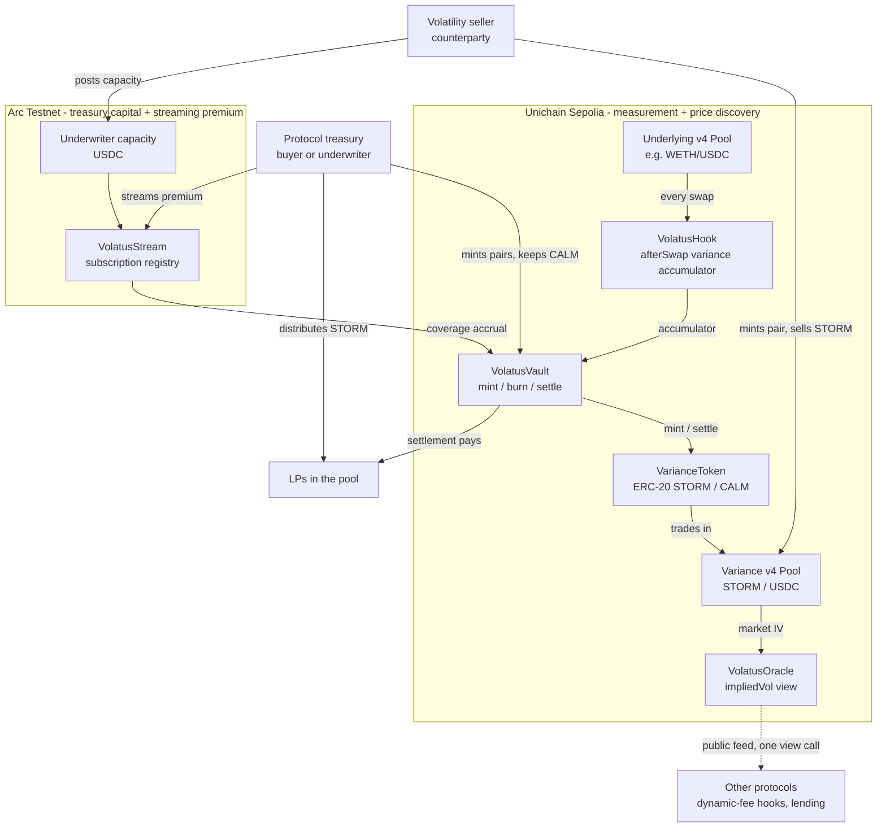
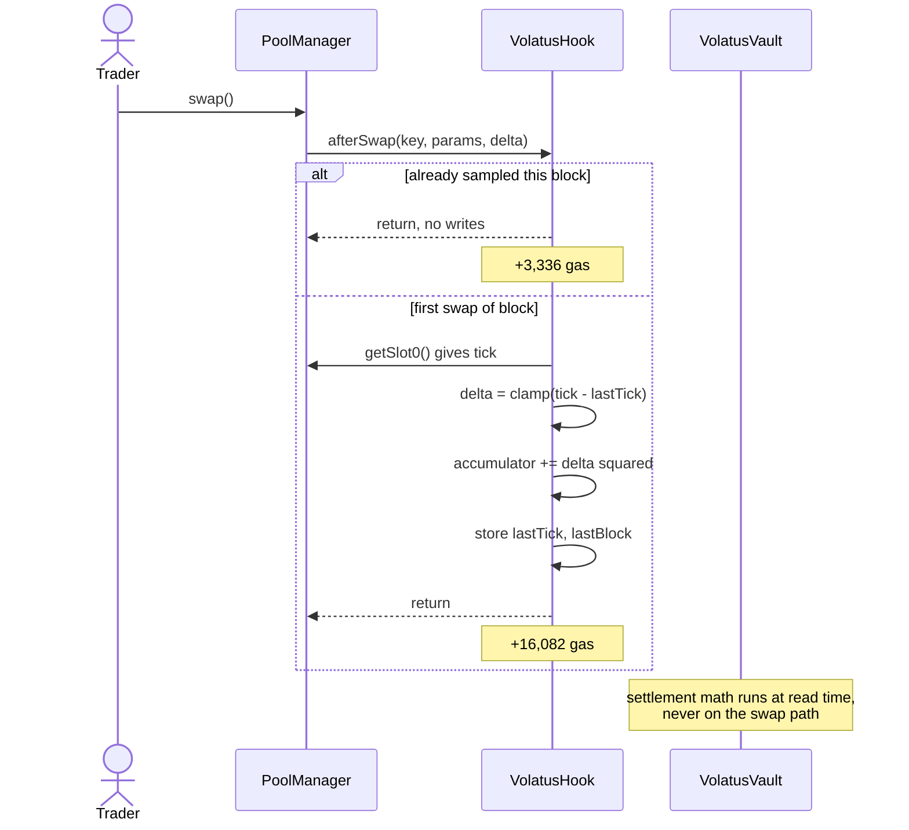
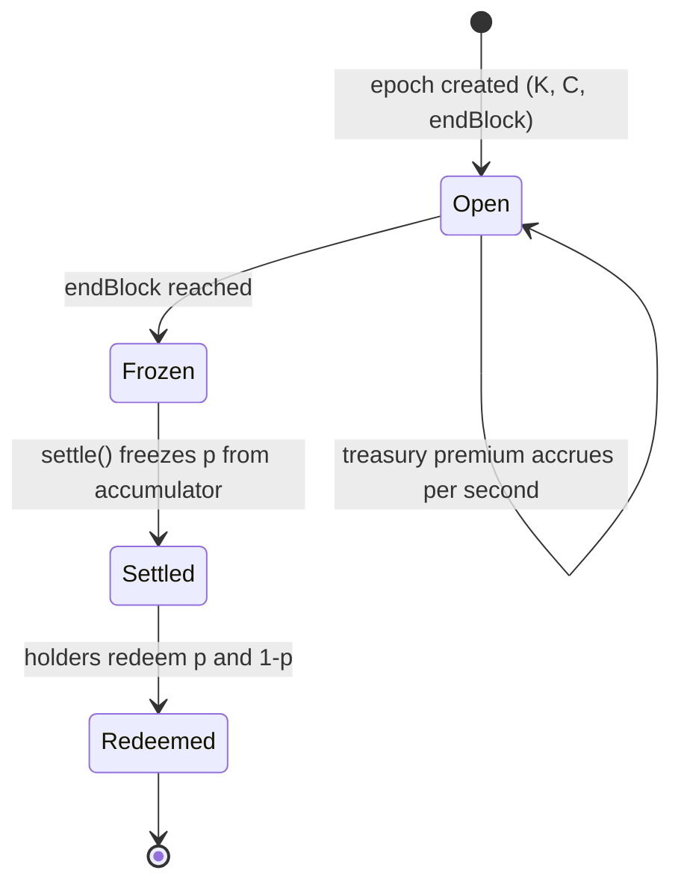
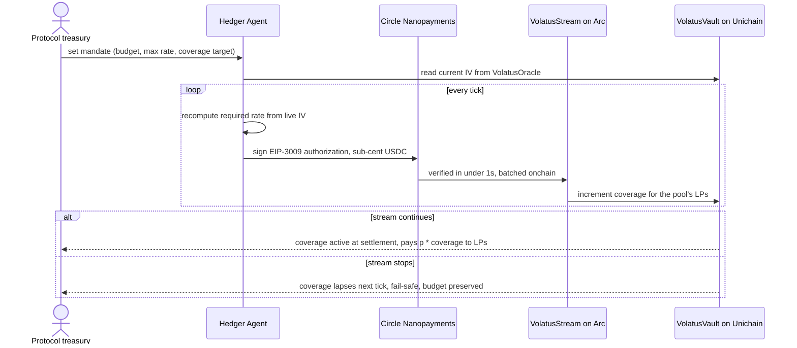
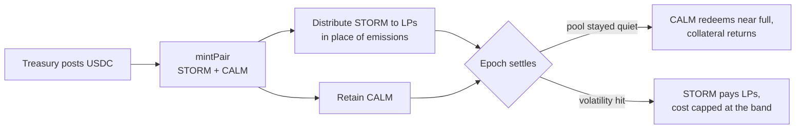
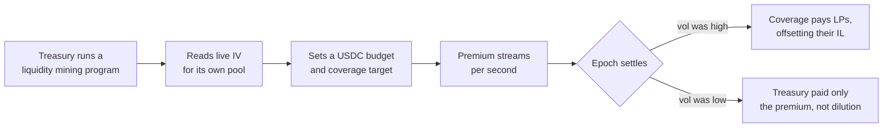
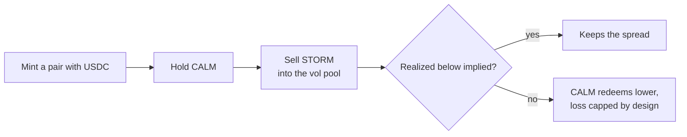
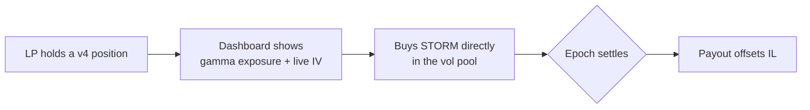

# Volatus

**Every protocol in DeFi is already paying for volatility. None of them know the price.**

Volatus is a Uniswap v4 hook that turns liquidity mining into a market. Protocols buy the impermanent-loss risk off their LPs at a discovered price, in USDC, instead of renting liquidity with permanent token emissions — or underwrite that risk themselves to deepen their own pool.

Built for ETHOnline 2026 · Uniswap Foundation · Arc (Circle) · Privy · Live on Unichain Sepolia + Arc Testnet

**Live:** [volatus-theta.vercel.app](https://volatus-theta.vercel.app/) · docs at [/docs](https://volatus-theta.vercel.app/docs)


## Table of Contents

- [The 30-second version](#the-30-second-version)
- [Who's on each side](#whos-on-each-side)
- [The Problem](#the-problem)
- [The Solution](#the-solution)
- [Why Uniswap Needs This](#why-uniswap-needs-this)
- [Uniswap Stack Integration](#uniswap-stack-integration)
- [Mechanism](#mechanism)
- [Manipulation Resistance](#manipulation-resistance)
- [Architecture](#architecture)
- [User Flows](#user-flows)
- [The Agents](#the-agents)
- [Project Structure](#project-structure)
- [Contract Surface](#contract-surface)
- [Deployments](#deployments)
- [Demo](#demo)
- [Limitations](#limitations)
- [Where to Look](#where-to-look)

---

## The 30-second pitch

A protocol emits tokens every week so that LPs will provide liquidity. Those emissions are dilution — permanent, paid forever, and sized by guesswork. The moment they slow, the liquidity leaves.

Ask what the protocol is actually buying. It is compensating LPs for impermanent loss. **It is paying for volatility insurance.** It has just never been able to buy it *as* insurance, because there is no price for volatility onchain. Options desks quote implied vol for BTC and ETH. For the thousands of tokens that actually live on Uniswap, no such number exists.

Volatus builds that price:

1. A v4 hook measures how much a pool is actually moving, straight from its own swap data. **No oracle.**
2. Two tokens trade against that measurement — **STORM** pays out when it moves, **CALM** pays out when it stays quiet. What they trade at *is* implied volatility.
3. A protocol treasury buys STORM on behalf of its LPs and pays only for realized risk, in stablecoins, at a market price.
4. Or it takes the other side itself: post USDC, mint pairs, hand STORM to LPs in place of emissions, and keep CALM. If the pool stays quiet the collateral comes back. **Underwriting your own pool's volatility is how you deepen it** — LPs supply more where the downside is covered.

LPs stay hedged. Nobody gets diluted. And as a by-product, every other protocol on the chain gets a volatility number it currently has to guess.

**One line:** *Liquidity mining is an insurance premium paid in inflation. Volatus turns it into a market.*

*(STORM and CALM are `VAR-LONG` and `VAR-SHORT` in the contracts.)*

---

## Who's on each side

| Actor | Puts in | Gets out | Why they show up |
|---|---|---|---|
| **Protocol treasury** (buyer) | USDC premium | Its LPs hedged, without emissions | Pays realized IL instead of permanent dilution — a line item that shrinks rather than compounds |
| **Token owner as underwriter** | USDC collateral | STORM to distribute, CALM retained | Deeper book, cost capped and pre-funded, collateral returned if volatility stays low |
| **Liquidity provider** | Nothing, or a small premium | Fee yield with the price risk stripped out | Can finally compute whether LPing is +EV *before* exiting, not after |
| **Volatility seller** | Buys CALM | Premium income, loss capped by design | A directional view on quiet markets with no other onchain expression |
| **Any protocol** | One view call | Market-implied volatility | Dynamic-fee hooks, lending haircuts and risk limits all guess this number today |

The treasury is the buyer. The volatility seller is the counterparty. **Both sides already exist** — one is spending real money on this risk right now, the other has no venue in which to sell it.

And the second row matters most for bootstrapping: **a protocol underwriting its own pool needs no counterparty at all.** It mints both legs, keeps one, distributes the other. That path works on day one, with nobody else in the market.

---

## The Problem

### Protocols are buying volatility insurance and overpaying in the worst possible currency

Every liquidity mining program is the same trade: a protocol pays LPs to bear a risk the LPs would otherwise refuse. That risk is impermanent loss. That payment is a premium.

But paying it in emissions is a bad way to buy insurance in four specific ways:

| | Emissions | What insurance should be |
|---|---|---|
| **Cost** | Permanent dilution, paid whether or not the risk materialises | Pay for realized risk |
| **Pricing** | Set by governance guesswork | Set by a market |
| **Duration** | Compounds forever | Ends when the term ends |
| **Retention** | Liquidity leaves the moment emissions slow | Nothing to leave — the risk is transferred, not rented |

This is not a small line item. Rented liquidity is the dominant cost structure of DeFi incentive design, and every "TVL cliff" is the same story: mercenary capital farms the emissions and exits.

### The LP side of the same trade

A concentrated liquidity position is, in payoff terms, a short straddle. You collect fees as premium and lose when price moves in either direction. In options language, LPs are short gamma — and they were never told.

The exposure is **unpriced and unhedgeable**:

| What an LP would need | Does it exist today? |
|---|---|
| Know how much volatility risk they hold | Only after the fact, at exit |
| Buy protection against it | No — outside BTC/ETH, nowhere |
| Know the fair price of that protection | No — no implied volatility exists onchain |

### Why nobody has fixed it

Several strong projects have attacked the adjacent problem, and it is worth being precise about where they stop:

- **Insurance and tranching designs** let an LP hand impermanent loss to a counterparty. Genuinely good work. But the transfer is **bilateral** — a claim on one specific position with one specific range. It cannot be aggregated, traded against another position, or quoted as a curve.
- Because there is no market, the premium is **computed rather than discovered**. These systems derive a price from trailing realized volatility, range width and notional. That is a model where a price should be, and models are backward-looking by construction. When realized vol is 40% but the market expects 90% next week — an unlock, an earnings print, a governance vote everyone can see on the calendar — a trailing model charges for 40% and the underwriter is destroyed.
- **Dynamic-fee hooks**, the most common hook category in existence, all need a volatility estimate and all compute it from trailing windows for the same reason: **there is nothing else to read.**

The missing piece is not risk transfer. It is a price.

---

## The Solution

Three layers. The first two live on Uniswap.

### Layer 1 — Measurement (Unichain, in the hook)

`VolatusHook` accumulates **realized variance** for a pool directly from that pool's own price path.

The elegant part: **a Uniswap tick is already a log price.** Since `tick = log₁.₀₀₀₁(price)`, the log return between two observations is just `Δtick × ln(1.0001)`. Realized variance is therefore a sum of squared tick deltas — no logarithms, no oracle, no external feed, no floating point:

```
realizedVariance(epoch) = Σ (Δtickᵢ)² × (ln 1.0001)²
```

Measured at the exact venue where the risk is borne, by the contract that already sees every price change.

### Layer 2 — The price (Unichain, in a second v4 pool)

Each epoch mints a pair of **capped variance tokens** as ERC-20s — one contract per leg per epoch, created as EIP-1167 clones:

| Token | Payoff at settlement |
|---|---|
| **STORM** (`VAR-LONG`) | Rises as realized variance rises, capped at ceiling `C` |
| **CALM** (`VAR-SHORT`) | The exact complement |

One USDC mints one of each. A pair redeems for **at most** one USDC combined — both legs round down independently, so the vault can retain sub-wei dust but can never owe it — which makes the system **fully collateralized by construction**: no insurance fund, no auto-deleveraging, no bad debt, no liquidation engine.

They are ERC-20s rather than ERC-6909 claims because STORM has to be a Uniswap v4 pool currency, and `type Currency is address` identifies a currency by address alone, with nowhere to put a token id. See [`DECISIONS.md`](./DECISIONS.md) §1.

STORM then trades in its own Uniswap v4 pool against USDC. Its price sits in `(0, 1)` and **is the market's expected normalized variance** — implied volatility, discovered by people with opposing views, on Uniswap.

That is the first onchain IV curve for arbitrary pairs.

### Protocols as underwriters

The most direct use of Volatus doesn't require anyone else to show up. A token owner posts USDC, mints pairs, distributes STORM to LPs in place of token emissions, and holds CALM. The economics invert cleanly against liquidity mining:

| | Emissions | Underwriting your own pool |
|---|---|---|
| Paid in | Permanent dilution | Pre-funded USDC |
| Cost if nothing happens | Full, forever | Collateral returned |
| Cost if volatility hits | Still full, plus the LPs leave anyway | Capped at the strike-to-cap band |
| LP's reason to stay | The emissions keep coming | The downside is covered |

**Deeper books are the point.** LPs size positions against worst-case impermanent loss. Cover that downside and the same capital should support more depth in the same pool — which is the outcome the token owner was buying with emissions all along, bought directly instead of rented.

It also solves the bootstrap problem. A market needs two sides, but a protocol underwriting its own pool *is* both sides — it mints the pair and keeps one leg. The vol pool then gives it somewhere to lay that risk off, which is why the market layer still matters even though the basic flow doesn't require it.

### Layer 3 — Coverage as a subscription (Arc, via Nanopayments)

Buying a whole epoch's protection up front is a lump-sum contract — a fossil of transaction costs. You batch risk into contracts because paying continuously costs more than the payment.

Circle Nanopayments removes that floor: gas-free USDC transfers down to $0.000001, verified in under a second via Circle Gateway, batched onchain later. So coverage becomes a **subscription**. A treasury streams premium per second at the prevailing market IV, and coverage accrues tick by tick. Stop streaming and coverage lapses at the next tick.

No term. No expiry. No lockup on the buyer's side. A budget line that can be turned down or off at any moment — which is precisely what emissions are not.

---

## Why Uniswap Needs This

**1. It replaces emissions with a market.**

Protocols currently pay LPs to absorb volatility risk through perpetual token emissions. Volatus lets them buy that risk directly, at a market price, in USDC — or underwrite it themselves with pre-funded, capped collateral. The cost becomes actual risk transferred rather than permanent inflation, and it lands on Uniswap rather than in a token contract.

**2. It gives token owners a direct lever on their own pool's depth.**

Today a protocol wanting a deeper Uniswap market has one tool: pay people to show up. Volatus gives it a second — cover the risk that keeps them away. Same objective, bounded cost, and the capital comes back if nothing happens.

**3. It makes passive LPing on volatile pairs survivable.**

An LP who can be hedged short-gamma — by themselves or by the protocol whose pool they're in — stays. That is the second half of the Fair Flow Frontier theme, *keeping volatile-pair liquidity sustainable*, which almost every entrant ignores in favour of the MEV half.

**4. The IV curve is a public good the rest of the stack consumes immediately.**

Every dynamic-fee hook estimates volatility from a trailing window because nothing better exists. With Volatus they read **market-implied** volatility — forward-looking instead of backward-looking — in one view call. That is a one-line integration across a large fraction of the 23,000+ hooks already deployed. Lending markets sizing collateral haircuts and risk systems setting position limits have the same gap.

**5. Under UNIfication, deeper liquidity is directly upstream of protocol revenue.**

The fee switch is on and protocol fees buy and burn UNI. LPs who can hedge stay; deeper volatile-pair liquidity routes more volume; more volume burns more UNI. Volatus's economics run in the currency Uniswap is now actually paid in.

**6. Uniswap is the natural home for this, and only Uniswap.**

The measurement has to happen where the risk is borne. A vol index built on a CEX feed is a different product with an oracle trust assumption. The Volatus index is generated by the pool whose LPs it protects, and priced in a pool on the same singleton.

---

## Uniswap Stack Integration

Volatus uses the Uniswap stack in **two distinct roles** — as the measurement surface and as the trading venue.

| Stack component | How Volatus uses it | Where |
|---|---|---|
| **New v4 hook** | `VolatusHook` — variance accumulator in `afterSwap`, plus `afterInitialize` to seed the cursor | `src/VolatusHook.sol` |
| **`BaseHook`** (OpenZeppelin `uniswap-hooks` v1.2.1) | Hook base class, permission flags, lifecycle callbacks. Moved out of v4-periphery upstream | `src/VolatusHook.sol` |
| **`HookMiner` / CREATE2** | Salt mining so the hook address encodes its permission bits | `script/MineSalt.s.sol` |
| **PoolManager singleton** | The measured pool; also hosts the variance-token pool | both pools |
| **ERC-20 pool currency** | Variance legs are ERC-20 clones so STORM can be a v4 pool currency | `src/VarianceToken.sol` |
| **Second v4 pool** | `VAR-LONG / USDC` — **this is where implied volatility is discovered** | `script/DeployVolPool.s.sol` |
| **PositionManager** | Seeding and managing liquidity in the variance pool | `script/SeedVolPool.s.sol` |
| **Universal Router + Permit2** | All swap routing in the frontend | `web/lib/router.ts` |
| **Dynamic fee flag** | Optional companion hook widening the vol pool's fee near settlement | `src/SettlementGuard.sol` |
| **Official repo contribution** | PR adding a `uniswap-variance` skill to `Uniswap/uniswap-ai` | see `FEEDBACK.md` |


## Mechanism

### Variance accumulation

Per pool, per epoch, `VolatusHook` maintains:

```solidity
struct VarianceState {
    uint256 accumulator;      // sum of (delta tick) squared
    int24   lastTick;         // last sampled tick
    uint48  lastBlock;        // block of last sample
    uint32  observations;     // sample count
}
```

On `afterSwap`:

1. If `block.number == lastBlock`, return immediately. **At most one observation per block.**
2. Read the pool's current tick.
3. `delta = clamp(tick - lastTick, +/- MAX_TICK_DELTA)`
4. `accumulator += uint256(int256(delta) * int256(delta))`
5. Store `lastTick`, `lastBlock`, increment `observations`

Two storage writes, once per block. Measured against three otherwise-identical pools:

| Swap | Gas | Delta |
|---|---|---|
| No hook | 119,875 | — |
| Hook that does nothing (v4's own dispatch) | 124,810 | +4,935 |
| First swap of a block through `VolatusHook` | 140,892 | **+16,082** for the measurement |
| Any later swap in the same block | 128,146 | **+3,336** — one storage read and a comparison |

The expensive part — converting the accumulator into a settlement price — is a `view` function that runs at read time and costs traders nothing.

### Settlement payoff

For an epoch with variance strike `K` and cap `C`:

```
V = accumulator * (ln 1.0001)^2          // realized variance
p = clamp(V - K, 0, C - K) / (C - K)     // normalized, in [0, 1]

STORM (VAR-LONG)  redeems for  p        USDC
CALM  (VAR-SHORT) redeems for  1 - p    USDC
```

The pair redeems for at most 1 USDC — each leg floors independently, so partial redemptions can never sum to more than the collateral held. Solvency is structural, not managed.

### Mint, trade, redeem

- **Mint:** deposit 1 USDC, receive 1 STORM + 1 CALM. Permissionless — this is the entry point a protocol uses to underwrite its own pool.
- **Burn:** return one of each before settlement, receive 1 USDC back. This arbitrage is what pins `p_storm + p_calm = 1` in the market.
- **Trade:** either leg trades in the v4 vol pool. The price of STORM is implied normalized variance.
- **Settle:** after `endBlock`, `p` is frozen from the accumulator and holders redeem.

### From price to implied volatility

```
impliedVariance = K + p * (C - K)
impliedVol      = sqrt(impliedVariance * annualizationFactor)
```

`VolatusOracle` exposes this as a single view call for any other protocol to read.

---

## Manipulation Resistance

The index settles money, so it must be attack-resistant in a way a display-only mark does not. A STORM holder is motivated to manufacture variance by wash-trading the pool.

Three structural defenses:

**1. One observation per block.** Intra-block round trips contribute nothing at all — the cheapest attack is eliminated outright, not merely made expensive.

**2. The attack pays the people it attacks.** Manufacturing price movement requires a real swap that pays the pool's fee, and a return swap that pays it again. Those fees go to the LPs the index exists to protect.

`test/fuzz/ManipulationCost.t.sol` attacks a real pool and measures what happens: **ten round trips across twenty blocks cost 0.30 units of currency and moved the payoff by 0.00144** — so an attacker would need to hold **694× the attack's cost** in STORM before manufacturing variance broke even. Cost scales exactly linearly (five rounds cost 0.15, twenty cost 0.60) while the payoff cannot pass the cap, so past saturation every additional block is pure loss.

The honest form of the claim is conditional: there is always *some* position large enough to fund an attack. What the defenses do is put it multiple orders of magnitude above the attack's cost.

**3. Per-observation clamping.** `MAX_TICK_DELTA` bounds how much any single observation can contribute, so a one-block dislocation — a large legitimate trade or a flash-loan spike — cannot dominate an epoch.

Note the difference from mark-based designs: there is **no per-position stored mark to poison and no settlement transaction to front-run.** The accumulator is append-only, and settlement reads it once after the epoch closes.

---

## Architecture

### System overview



### Variance measurement — the hot path



### Epoch lifecycle



### Treasury coverage, streamed



**Liveness note, stated deliberately:** the index, the collateral, and settlement live entirely in contracts on Unichain. Arc is a payment rail for a subscription, never part of settlement. If Arc, Gateway or the agents are unavailable, streams stop and coverage lapses — nothing is stuck, nothing is at risk, and no settlement depends on an off-chain component.

---

## User Flows

### A — Token owner underwrites its own pool (no counterparty needed)



### B — Protocol treasury buys coverage at market price



### C — Selling volatility



### D — An LP hedges independently



### E — A protocol reads the curve

```solidity
// A dynamic-fee hook prices its fee off market-implied vol
// instead of a trailing window
uint256 iv  = volatusOracle.impliedVol(poolId);
uint24  fee = baseFee + uint24(iv * feeSensitivity / 1e18);
```

One view call. This is the composability argument, and it is three lines.

---

## The Agents

Agents hold Circle Wallets, spend USDC autonomously, and act on signals read from Uniswap contracts. Their decision logic is tied to onchain state, not to prompts.

| Agent | Signal | Action | Cadence |
|---|---|---|---|
| **Hedger** (treasury side) | Pool gamma exposure × live accumulator; IV from the vol pool | Adjusts streamed rate and coverage notional within the mandate | Every tick |
| **Underwriter** (seller side) | Realized vs implied spread; inventory concentration | Requotes offered rate; withdraws capacity as risk concentrates | Every tick |

**Why agents are structural, not decorative:** the premium rate re-prices against live IV every block. No human requotes a volatility surface every second. A continuously-priced market only exists if agents run both sides — the granularity Nanopayments enables is the granularity that requires automation.

**Privy** secures the delegation. The agent signs with a session signer under a TEE-enforced policy:

```
Policy: volatus-hedger-v1
  |- allow  method: streamPremium | adjustCoverage
  |- allow  target: VolatusStream only
  |- deny   all ERC20 transfers to other recipients
  |- cap    cumulative spend <= declared mandate
```

A fully compromised Volatus backend cannot move a treasury's funds anywhere except into premium payments on the pool it authorised, and cannot exceed the mandate. For a treasury delegating a recurring budget to software, that bound is the whole conversation.

---

## Project Structure

```
volatus/
├── contracts/                              # Foundry
│   ├── src/
│   │   ├── VolatusHook.sol                 # * the v4 hook - variance accumulator
│   │   ├── VolatusVault.sol                # mint / burn / settle, USDC collateral
│   │   ├── VarianceToken.sol               # ERC-20 STORM / CALM (clone per leg)
│   │   ├── VolatusOracle.sol               # impliedVol() - the public feed
│   │   ├── VolatusStream.sol               # subscription + coverage accrual
│   │   ├── SettlementGuard.sol             # optional vol-pool dynamic fee hook
│   │   ├── libraries/
│   │   │   ├── VarianceMath.sol            # * tick deltas -> variance -> IV
│   │   │   ├── PayoffMath.sol              # capped payoff, strike/cap normalization
│   │   │   └── EpochCursor.sol             # one-observation-per-block sampling
│   │   └── interfaces/
│   │       ├── IVolatusOracle.sol          # what other protocols integrate against
│   │       ├── IVolatusVault.sol
│   │       └── IVolatusStream.sol
│   ├── test/
│   │   ├── unit/
│   │   ├── integration/
│   │   │   ├── FullEpoch.t.sol             # mint -> trade -> settle -> redeem
│   │   │   ├── SelfUnderwrite.t.sol        # * mint, keep CALM, distribute STORM, settle
│   │   │   ├── VolPoolPricing.t.sol        # IV derivation from pool price
│   │   │   ├── PoolCurrencyConstraint.t.sol # why ERC-20, not ERC-6909
│   │   │   └── StreamCoverage.t.sol        # accrual and lapse
│   │   ├── fuzz/
│   │   │   ├── VarianceInvariants.t.sol    # accumulator over full tick range
│   │   │   ├── SolvencyInvariant.t.sol     # * pair never redeems for > 1 USDC
│   │   │   └── ManipulationCost.t.sol      # * measured attack cost vs gain
│   │   └── fork/UnichainSepolia.t.sol
│   └── script/
│       ├── MineSalt.s.sol                  # HookMiner CREATE2 salt
│       ├── DeployVolatus.s.sol
│       ├── DeployVolPool.s.sol             # the STORM/USDC v4 pool
│       ├── SeedVolPool.s.sol
│       ├── Underwrite.s.sol                # * treasury mints and distributes STORM
│       ├── TradeVol.s.sol                  # * reprices IV, prints before/after
│       └── DemoVolatility.s.sol            # scripted price episode for the demo
│
├── agents/                                 # TypeScript, Circle Agent Stack
│   └── src/{hedger,underwriter,signals,nanopay}.ts, privy/policies.ts
│
├── sim/                                    # the evidence
│   ├── emissionsComparison.ts              # * premium cost vs equivalent emissions
│   ├── manipulation.ts                     # cost vs gain boundary plot
│   ├── ivVsRealized.ts                     # index vs a reference vol estimate
│   └── out/                                # charts used in the video
│
├── web/                                    # Next.js 14 + TypeScript + viem/wagmi
│   ├── app/{page,pool/[id]/page,treasury/page,underwrite/page}.tsx
│   └── components/{IVCurve,VarianceAccumulator,StreamMeter,EmissionsVsPremium}.tsx
│
├── FEEDBACK.md                             # * prize qualification requirement
├── DECISIONS.md                            # * deviations from this spec, with evidence
├── INTEGRATION.md                          # * consuming the IV feed from another protocol
├── PROGRESS.md                             # * what is built, what is not, with evidence
└── README.md
```

---

## Contract Surface

```solidity
interface IVolatusOracle {
    /// @notice Market-implied volatility for a pool, annualized, 1e18 fixed point.
    /// @dev    This is the integration point for other protocols. One view call.
    function impliedVol(PoolId id) external view returns (uint256);

    /// @notice Realized variance accumulated so far in the current epoch.
    function realizedVariance(PoolId id) external view returns (uint256);

    /// @notice Current epoch parameters.
    function epoch(PoolId id)
        external view returns (uint64 endBlock, uint256 strike, uint256 cap);
}

interface IVolatusVault {
    /// @notice Deposit `amount` USDC, receive `amount` of each leg.
    /// @dev    A protocol underwriting its own pool calls this, then distributes
    ///         STORM to its LPs and retains CALM. No counterparty required.
    function mintPair(PoolId id, uint256 amount) external;

    /// @notice Return one of each leg before settlement, receive USDC back.
    function burnPair(PoolId id, uint256 amount) external;

    /// @notice Freeze the payoff from the accumulator. Permissionless after endBlock.
    function settle(PoolId id) external returns (uint256 payoffX18);

    /// @notice Redeem a settled leg for its share of collateral.
    function redeem(PoolId id, bool long, uint256 amount) external;
}
```

```solidity
// VolatusHook.sol - the entire hot path
function _afterSwap(
    address,
    PoolKey calldata key,
    SwapParams calldata,
    BalanceDelta,
    bytes calldata
) internal override returns (bytes4, int128) {

    PoolId id = key.toId();
    VarianceState storage s = state[id];

    // at most one observation per block - kills intra-block wash trading
    if (s.lastBlock == uint48(block.number)) {
        return (BaseHook.afterSwap.selector, 0);
    }

    (, int24 tick,,) = poolManager.getSlot0(id);

    int256 delta = int256(tick) - int256(s.lastTick);
    if (delta >  MAX_TICK_DELTA) delta =  MAX_TICK_DELTA;
    if (delta < -MAX_TICK_DELTA) delta = -MAX_TICK_DELTA;

    s.accumulator += uint256(delta * delta);   // tick IS log price - no logs needed
    s.lastTick     = tick;
    s.lastBlock    = uint48(block.number);
    unchecked { s.observations++; }

    return (BaseHook.afterSwap.selector, 0);
}
```

---

## Deployments

### Unichain Sepolia (chain ID 1301)

Chosen because a variance index samples per block: ~1s blocks give ~86,400 observations a day versus ~7,200 on L1. A statistically meaningful epoch takes minutes instead of days — a design requirement, not a demo convenience.

**Live.** RPC `https://sepolia.unichain.org`.

| Contract | Address |
|---|---|
| **`VolatusOracle`** — the integration point | [`0xd7602c41f01dD3a91F8768869D95f9529a112a7c`](https://sepolia.uniscan.xyz/address/0xd7602c41f01dD3a91F8768869D95f9529a112a7c) |
| **`VolatusHook`** — the v4 hook | [`0x9215C247Ec3C0082A4bfC26515427c2737D1d040`](https://sepolia.uniscan.xyz/address/0x9215C247Ec3C0082A4bfC26515427c2737D1d040) |
| **`VolatusVault`** — collateral and settlement | [`0xF45894c8384c440FC63Da67Bc6050e77FcaF4e83`](https://sepolia.uniscan.xyz/address/0xF45894c8384c440FC63Da67Bc6050e77FcaF4e83) |
| `VarianceToken` implementation (cloned per leg) | `0xBE28c060b7F6Cb8C055430eA1CE75d8C577b2d21` |

The hook's address is not arbitrary — its low bits encode the permissions it declares. `0x…d040` ends in `0b01000001000000`: `AFTER_INITIALIZE` and `AFTER_SWAP` set, every return-delta bit clear.

### Epoch 1

| | |
|---|---|
| STORM (`VAR-LONG`) | `0x2695E18e9170736961132f48192A6c0C9e1e8338` |
| CALM (`VAR-SHORT`) | `0xc1181292D6Ac4e583d2c0ED56Ef6ba864E1EaCA1` |
| Measured pool id (mWETH/mUSDC) | `0xc60f25d0a8e2ec722cc0d7f2cff8179340bd5a034351319ada88292d23f21b89` |
| **Variance pool id** (STORM/mUSDC) — where IV is discovered | `0xdf96625a144c5036ab7fce0b67ead96df47ca86335e29ee87f65fb4ef072affc` |
| Strike / cap | `0` / `0.02e18` |
| Horizon | 3,600 seconds |

### Test tokens and routers

Mocks and v4-core test helpers, deployed for convenience. **Not part of the protocol.**

| | Address |
|---|---|
| mWETH (open faucet) | `0xde45563c9c596fC761e3a18ABB66aE51904de0F4` |
| mUSDC (open faucet, collateral) | `0xd00FaDdE160cecbB3ad946BE3542b9553c5B582B` |
| `PoolSwapTest` router | `0xF8B077ccC960089FDC0d633E90a6A991cbdB5EB8` |
| `PoolModifyLiquidityTest` router | `0xc05F9C18ad53A4AF485Bf34840E3B062462546d6` |

### Uniswap contracts it builds on

Each confirmed three ways: v4-periphery broadcast records for chain 1301, a live `eth_getCode` plus `owner()` call, and the published deployments page.

| | Address |
|---|---|
| PoolManager | `0x00B036B58a818B1BC34d502D3fE730Db729e62AC` |
| PositionManager | `0xf969Aee60879C54bAAed9F3eD26147Db216Fd664` |
| StateView | `0xc199F1072a74D4e905ABa1A84d9a45E2546B6222` |
| Permit2 | `0x000000000022D473030F116dDEE9F6B43aC78BA3` |
| CREATE2 factory (hook salt mining) | `0x4e59b44847b379578588920cA78FbF26c0B4956C` |

### Read the number yourself

```bash
cast call 0xd7602c41f01dD3a91F8768869D95f9529a112a7c \
  "impliedVol(bytes32)(uint256)" \
  0xc60f25d0a8e2ec722cc0d7f2cff8179340bd5a034351319ada88292d23f21b89 \
  --rpc-url https://sepolia.unichain.org
```

Returns WAD-scaled annualized volatility: `1e18` = 100%.

### The price is discovered, not configured

25,000 mUSDC of variance pairs were minted and the STORM/mUSDC pool seeded with liquidity, so the price can be traded rather than merely displayed. A single real trade repricing volatility:

```
                       STORM price      implied variance (normalized)
before the trade       0.300            0.300 of cap
after  the trade       0.486            0.486 of cap
```

A trader spent collateral to buy STORM; its price rose; the implied volatility other protocols read rose with it. **That is a discovered price — the number two parties with opposing views agreed on — not a parameter anybody configured.** It is the whole point of the design.

Reproduce it with `forge script script/TradeVol.s.sol`, which prints implied vol before and after.

**Scope of the claim, stated precisely:** the pool, the liquidity and the trade are real and onchain, and anyone can reproduce them. The counterparty was a script rather than an independent trader. So the *mechanism* of price discovery is demonstrated; the *depth* of the market is not, and cannot be at this stage.

An earlier deployment ran a full epoch to settlement before being replaced (see [`DECISIONS.md`](./DECISIONS.md) §14): realized variance `0.038152` against a `0.020000` cap, so the payoff pinned at 1.0 — STORM paid in full, CALM paid nothing, and the collateral left in the vault matched the unredeemed STORM exactly.

### Arc Testnet

**Live.** Chain ID **5042002**.

| Contract | Address |
|---|---|
| `VolatusStream` | `0xD7EeD2a64762A7038d64886882161bA1b1EfC074` |
| USDC (ERC-20 view) | `0x3600000000000000000000000000000000000000` |

Capacity and the first subscription are funded onchain. A `sync` twenty-two seconds after funding moved exactly twenty-two seconds of coverage and 0.0022 USDC of premium from the subscriber to the underwriter pool — **coverage accruing per second, on a real chain.**

On Arc, USDC is *simultaneously* the native gas asset (18-decimal view) and an ERC-20 at `0x3600…0000` (6-decimal view). They are the same pool of funds seen two ways, not two assets.

---


Developer feedback: [`FEEDBACK.md`](./FEEDBACK.md) — written from real friction hit during the build (hook salt mining, `getSlot0` access patterns, the ERC-6909 pool-currency constraint, dynamic fee semantics), not as a formality.

---

## Local Development

```bash
git clone https://github.com/<org>/volatus && cd volatus

# Contracts
cd contracts
forge install
forge build
forge test -vvv

forge test --match-path "test/fork/*" --fork-url $UNICHAIN_SEPOLIA_RPC

forge script script/MineSalt.s.sol
forge script script/DeployVolatus.s.sol --rpc-url $UNICHAIN_SEPOLIA_RPC --broadcast --verify
forge script script/DeployVolPool.s.sol --rpc-url $UNICHAIN_SEPOLIA_RPC --broadcast
forge script script/Underwrite.s.sol --rpc-url $UNICHAIN_SEPOLIA_RPC --broadcast
forge script script/TradeVol.s.sol --rpc-url $UNICHAIN_SEPOLIA_RPC --broadcast

# Agents
cd ../agents && pnpm install && pnpm start

# Web
cd ../web && pnpm install && cp .env.example .env.local && pnpm dev
```

```
UNICHAIN_SEPOLIA_RPC=
ARC_TESTNET_RPC=
PRIVATE_KEY=
NEXT_PUBLIC_PRIVY_APP_ID=
PRIVY_APP_SECRET=
CIRCLE_API_KEY=
NEXT_PUBLIC_VOLATUS_ORACLE=
NEXT_PUBLIC_VOLATUS_VAULT=
NEXT_PUBLIC_PERMIT2=0x000000000022D473030F116dDEE9F6B43aC78BA3
```

---

## License

MIT
